# Guida all'Uso del Sito WordPress – Nazione Lombarda

## Intro

Benvenuto nella guida ufficiale per la gestione del sito WordPress. Qui troverai tutte le istruzioni necessarie per gestire i contenuti, gli utenti e le funzionalità principali del sito.

Per accedere ai vari pannelli di controllo è necessario inserire le credenziali per le seguenti piattaforme:

- Hosting + Dominio
- Wordpress

## Aruba

Aruba è il provider che permette di avere il proprio sito online(hosting) al dominio scelto in precedenza (es. nazionelombarda.org). Si occupa dunque della gestione del dominio e dell'hosting del tuo sito web.

### Pannello di controllo Hosting

Per effettuare l'accesso al pannello di controllo del provider hosting:

URL Login: <https://admin.aruba.it/PannelloAdmin/Login.aspx>

Username: 18076584@aruba.it

Password: Nazionelombarda84!

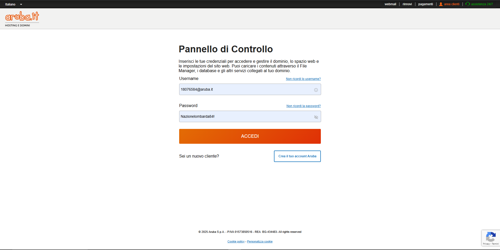

### Caselle email Aruba

Per effettuare l'accesso alle caselle email web:

URL Login: <https://webmail.aruba.it/>

#### Credenziali di accesso

Indirizzo: info@nazionelombarda.org

Password: #y8-j9#LKmx-Zd+

Indirizzo: presidente@nazionelombarda.org

Password: Temp2001!

Indirizzo: segretario@nazionelombarda.org

Password: Temp2001!

## WordPress

Wordpress è il software "motore" del tuo sito web.

Per effettuare l'accesso al pannello di controllo del software Wordpress:

URL Login: <https://www.nazionelombarda.org/wp-admin>

Username Admin: Amministratore

Password: PaoloSizziNazioneLombarda1234

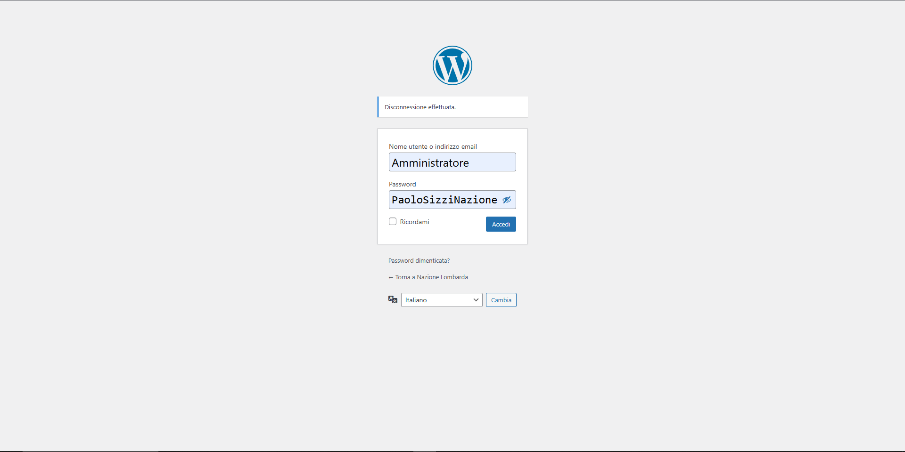

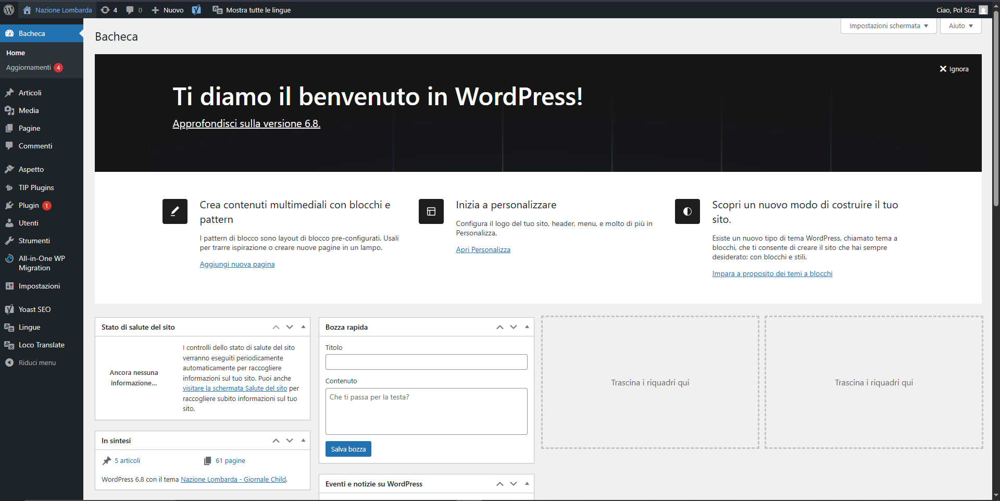

Attraverso il pannello di controllo è possibile gestire ogni aspetto del proprio sito web, come:

### Gestione Annunci

Una volta effettuato l'accesso al pannello di controllo attraverso il link: <https://nazionelombarda.org/wp-admin>

1. Dalla Homepage click su "Personalizza"

    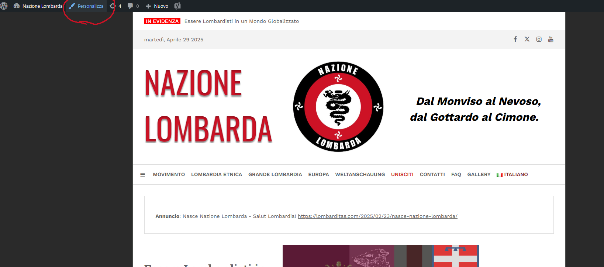

    oppure accedi direttamente qui: <https://www.nazionelombarda.org/wp-admin/customize.php?url=https%3A%2F%2Fwww.nazionelombarda.org%2F>

2. Click su "Widget"

    Una volta atterrati su questa schermata, selezionare la voce "Widget":

    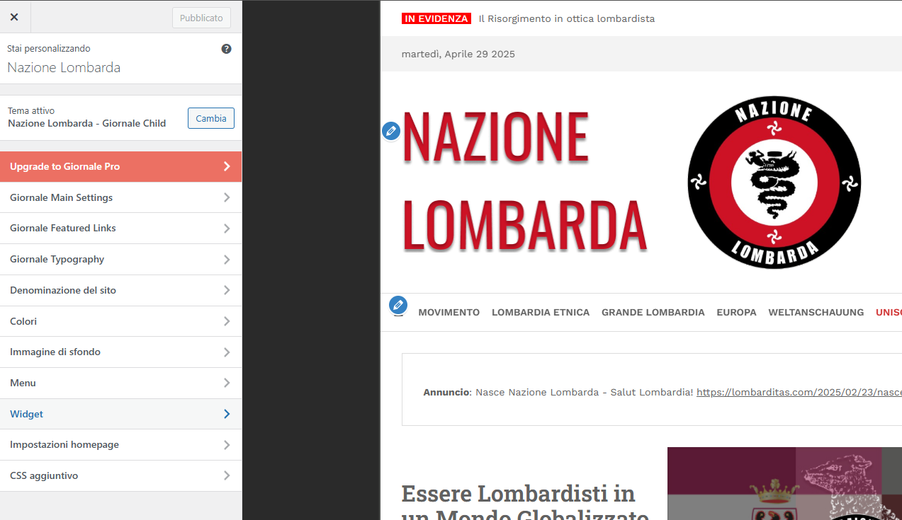

3. Click su "Header widget area"

    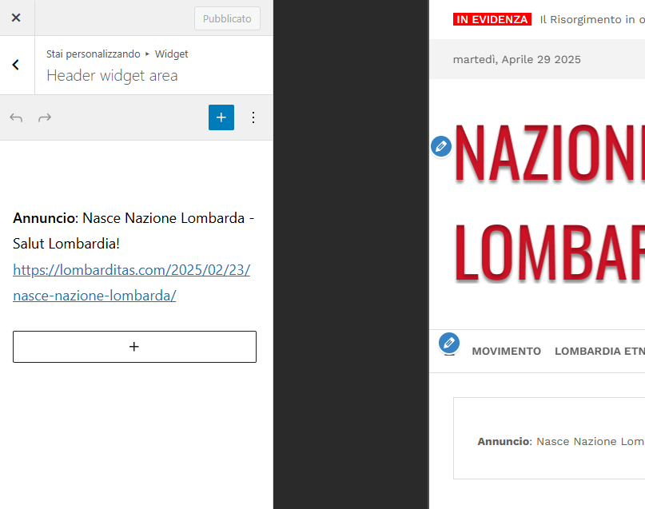

   A questo punto sarà possibile modificare o eliminare completamente i contenuti.

### Gestione Link Social

Per modificare i link dei profili social associati ai bottoni "social":

1. Dalla Homepage click su "Personalizza"

    

    oppure accedi direttamente qui: <https://www.nazionelombarda.org/wp-admin/customize.php?url=https%3A%2F%2Fwww.nazionelombarda.org%2F>

2. Click su "Giornale Main Settings"
3. Click su "Social Links and Footer"

    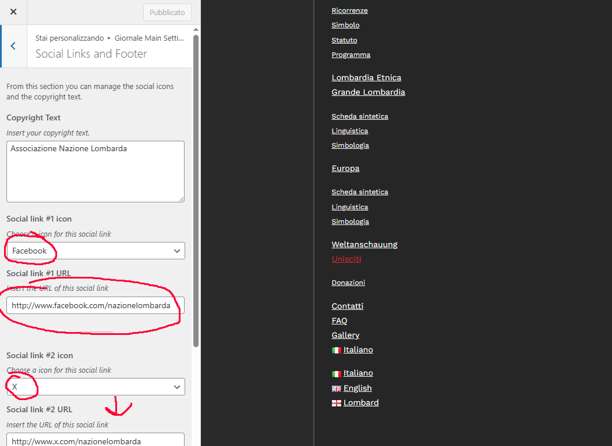

    A questo punto sarà possibile modificare o eliminare completamente i contenuti.

### Moderazione Commenti

Per inserire delle parole "proibite" per la moderazione dei commenti dal pannello di controllo:

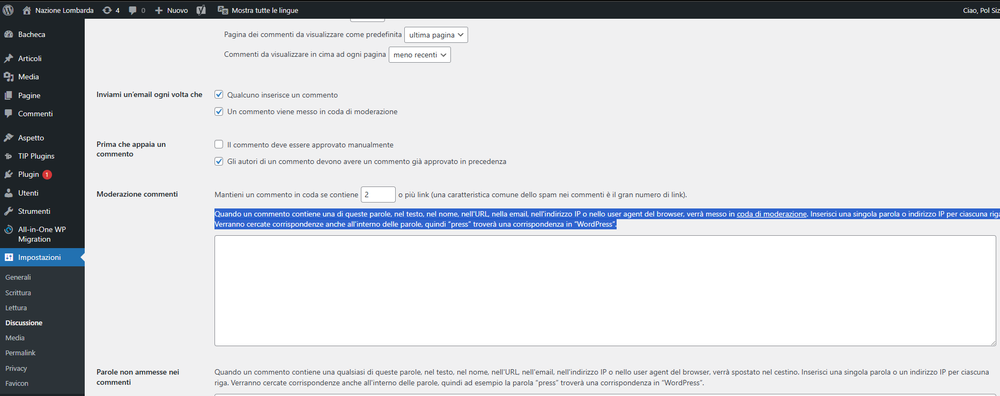

1. Click sulla voce "Impostazioni"

2. Click su "Discussione"

3. Scorrere fino alla voce "Moderazione commenti"

### Gestione Articoli

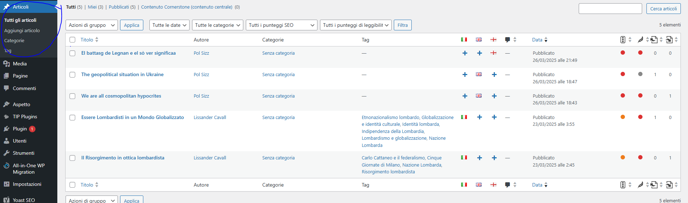

- **Nuovo articolo**

    Vai su Articoli > Aggiungi nuovo

    Inserisci titolo, contenuto, immagini, categorie e tag

    Salva bozza o pubblica

- **Modifica articolo**

    Vai su Articoli > Tutti gli articoli

    Clicca su "Modifica" sotto l'articolo desiderato

- **Elimina articolo**

    Dal pannello articoli, clicca su Cestina

### SEO

Per la SEO è stato utilizzato il noto plugin YoastSEO.

E' possibile ottenere un impatto significativo sulla SEO modificando adeguatamente e regolarmente le seguenti voci presenti nel menu di YoastSEO:

- Parole Chiave
- Titolo
- Meta description(descrizione del contesto)

Idealmente ogni articolo dovrebbe contenere delle parole chiave associate al contesto dell'articolo stesso.

N.B: le "parole chiave" non sono altro che parole ricercate più comunemente nei motori di ricerca come Google.

### Gestione Utenze

E' possibile aggiungere, modificare o rimuovere utenti con ruoli diversi.

Vai su Utenti > Aggiungi nuovo

Scegli ruolo: Amministratore, Editore, Autore, Collaboratore, Sottoscrittore

Modifica o elimina utenti esistenti

### Ripristino del sito

Qualora in futuro dovessero presentarsi problemi dovuti ad una errata configurazione del sito o qualsiasi altro problema di natura tecnica non risolvibile facilmente, sarà possibile ripristinare il sito web alla condizione iniziale.

- **Ripristina il sito web**

    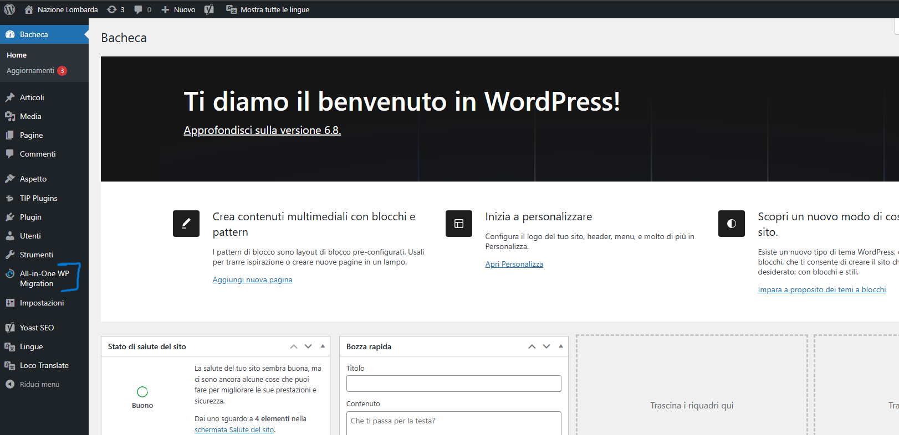

    Vai alla voce All-in-One WP Migration > Backup (es. UpdraftPlus, All-in-One WP Migration)

    Seleziona un backup → Ripristina

    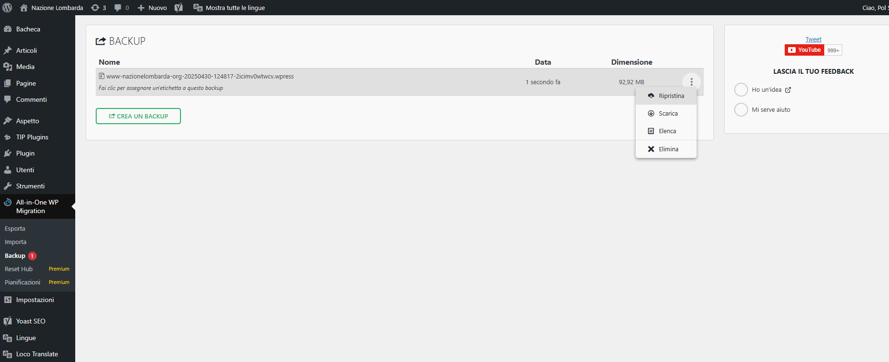

    In questo modo il sito verrà ripristinato alle condizioni iniziali, come se fosse appena stato consegnato.

- **Crea nuovo ripristino**

    Nel caso invece si volesse creare un nuovo punto di ripristino (magari dopo aver effettuato delle modifiche importanti al sito che si vogliono preservare), basterà:

    1. Accedere alla sezione backup

    2. Clicca su "Crea nuovo backup"

## Note finali

- Ricorda di aggiornare il sito almeno 1 volta ogni 2 anni.

- Effettua backup prima di ogni modifica importante.

Per qualsiasi dubbio: <https://cyberware-industries.com/contacts>

